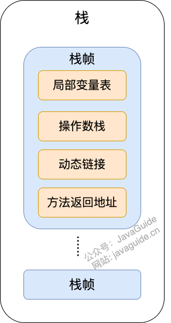

#### Java 内存区域详解

##### 运行时数据区域

##### 线程私有：

- ##### 程序计数器

- ##### 本地方法栈

- ##### 虚拟机栈

##### 线程共享的：

- ##### 堆

- ##### 方法区

- ##### 直接内存

> ##### java虚拟机规范对于运行时数据区域的规划时相对宽松的。以堆为例：堆可以是连续空间，也可以不连续。堆的带线啊哦可以固定，也可以再运行时按需扩展。

#### 程序计数器

##### 程序计数器是一块比较小的内存空间，可以看作是当前线程所执行的字节码的行号指示器。字节码解释器工作时通过改变这个计数器的值来选取下一条需要执行的字节码指令，分支、循环、跳转、异常处理、线程恢复等功能都需要依赖这个计数器来完成。

##### 另外，为了线程切换后能恢复到正确的执行位置，每条线程都需要有一个独立的程序计数器，各线程之间计数器互不影响，独立存储，我们称这类内存区域为“线程私有”的内存

##### 程序计数器的两个作用：

- ##### 字节码解释器通过改变程序员计数器来一次读取指令，从而实现代码的流程控制，如：顺序执行、选择、循环、异常处理。

- ##### 在多线程的情况下，程序计数器用于记录当前线程执行的位置，从而当线程被切换回来的时候能够知道线程上次运行到的位置

##### 【注】：程序计数器是唯一一个不会出现==OutOfMemoryError==的内存区域，它的生命周期随着线程的创建而创建，随着线程的结束而死亡。

#### Java虚拟机栈

##### 与程序计数器一样，Java虚拟机栈也是线程私有的，它的生命周期和线程相同，随着线程的创建而创建，随着线程的死亡而死亡。

##### 栈绝对算的上是JVM运行时数据区域的一个核心，除了一些Native方法调用时通过本地方法栈实现的，其他所有的Java方法都是通过栈来实现的（也需要和其他运行时数据区域比如程序计数器配合）

##### 方法调用的数据需要通过栈进行传递，每一次方法调用都会有一个对应的栈帧被压入栈中，每一个方法调用结束后，都会有一个栈帧被弹出。

##### 栈由一个个栈帧组成，而每个栈帧中拥有：局部变量表、操作数栈、动态链接、方法返回地址。和数据结构上的栈类似，两者都是先进先出的结构，只支持出栈和入栈两种操作。

##### 局部变量表：主要存放了编译期可知的各种数据类型（boolean、byte、char、short、int、float、long、double）、对象引用（reference类型，它不同于对象本身，可以是一个指向对象起始地址的引用指针，也可能是指向一个代表带向的句柄或其他与此对象相关的位置）

##### 操作数栈：主要作为方法调用的中转站使用，用于存放方法执行过程中产生的中间计算结果。另外，计算过程中产生的临时变量也会放在操作数栈中。

##### 动态链接：主要服务一个方法需要调用其他方法的场景。在Java源文件被编译成为字节码时，所有的变量和方法引用都作为符号引用（Symbilic Reference）保存在Class文件的常量池里。当一个方法要调用其他方法，需要将常量池中指向方法的符号引用转化为其在内存地址中的直接引用。动态链接的作用就是为了将符号引用转换为调用方法的直接引用。

##### 栈空间虽然不是无限大的，但一般正常调用的其概况下是不会出现问题的。不过，如果函数调用陷入无限循环的话，就会导致栈中被压入太多栈帧而占用太多空间，导致栈空间过深。那么当线程请求栈的深度超过当前Java虚拟机栈的最大深度的时候，就抛出==StackOverFlowError==错误。

##### Java方法有两种返回方式，一种是return语句正常返回，一种是抛出异常。不管是哪种返回方式，都会导致栈帧被弹出。也就是说，栈帧随着方法调用而创建，随着方法结束而销毁。无论方法正常完成还是异常完成都属于方法结束。

##### 除了==StackOverFlowError==错误之外，栈还可能会出现==OutOfMemoryError==错误，这是因为如果栈的内存大小可以动态扩展，如果虚拟机在动态扩展栈时无法申请到足够的内存空间，则抛出==OutOfMemoryError==错误

##### 程序运行中栈可能会出现的两种错误：

- ##### StackOverFlowError：若栈的内存大小不允许动态扩展，那么当线程请求栈的深度超过当前Java虚拟机栈的最大深度的时候，就抛出StackOverFlowError的错误

- ##### OutOfMemoryError：如果栈的内存大小允许动态扩展，如果虚拟机在动态扩展栈时无法申请到足够的空间，则抛出OutOfMemoryError错误。

#### 本地方法栈

##### 和虚拟机栈所发挥的作用非常相似，区别是：虚拟机栈为虚拟机执行Java方法（也就是字节码）服务，而本地方法栈则为虚拟机使用到的Native方法服务。在HotSpot虚拟机种和Java虚拟机栈合二为一。

##### 本地方法被执行的时候，在本地方法栈也会创建一个栈帧，用于存放该本地方法的局部变量表、操作数栈、动态链接、出口信息。

##### 方法执行完毕后相应的栈帧也会出栈并释放内存空间，也会出现StackOverFlowError和OutOfMemoryError错误

