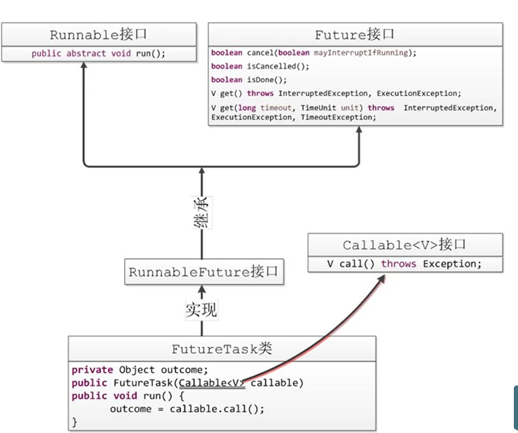

## <font color='red'>callable </font>


> #### callable 接口提供了接口的返回值 ，也可以抛出异常


#### callable接口提供了call()方法，结果必须存储在主线程的已知对象中，以便主线程得到线程返回的结果。

- ##### Future对象可以来接收线程的返回值。


##### 创建线程的方式与<font color='cornflowerblue'>Thread</font>和<font color='cornflowerblue'>Runnable</font>不同。


##### Callable、Future、FutureTask 三者之间的关系




##### callable创建

```java
//1.借助FutureTask
class CallableTest implements Callable<String> {

    @Override
    public String call() throws Exception {
        System.out.println("线程执行");
        return "success";
    }
}

public class CallableStudy {
    public static void main(String[] args) throws ExecutionException, InterruptedException {
        
        //创建callable对象
        CallableTest callableTest = new CallableTest();
        FutureTask futureTask = new FutureTask(callableTest);

        new Thread(future).start();
        Object o = futureTask.get();
        System.out.println(o);

    }
}
```


##### 借助线程池来执行

```java
//2.借助线程池
class CallableTest implements Callable<String> {

    @Override
    public String call() throws Exception {
        System.out.println("线程执行");
        return "success";
    }
}

public class CallableStudy {
    public static void main(String[] args) throws ExecutionException, InterruptedException {

        CallableTest callableTest = new CallableTest();
        FutureTask futureTask = new FutureTask(callableTest);
        ExecutorService executorService = Executors.newCachedThreadPool();
        executorService.submit(futureTask);
        Object o = futureTask.get();
        System.out.println(o);
    }
}

```


- #### <font color='red'>注</font>

  - ##### Future对象的get会<font color='orange'>阻塞线程</font>
