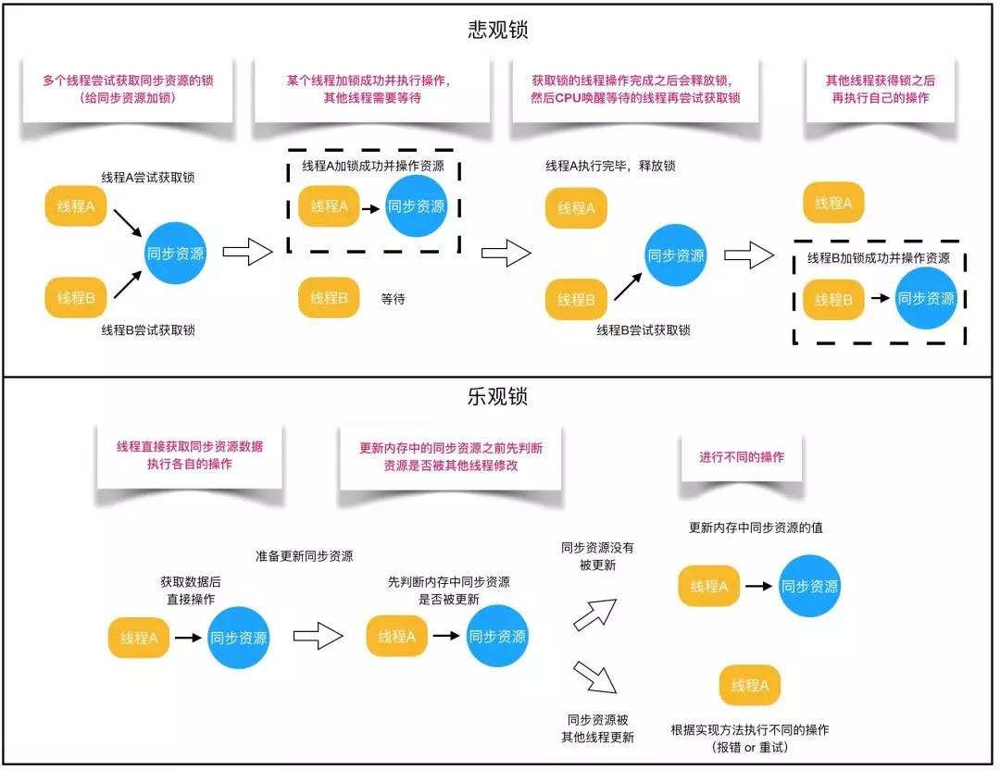
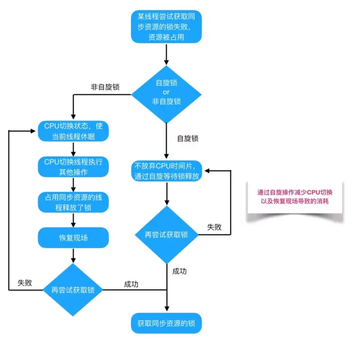

## 锁

#### 乐观锁vs悲观锁

##### 乐观锁和悲观锁是一种广义上概念，体现了看待线程同步的不同角度。

##### 悲观锁：对于同一数据的并发操作，悲观锁认为自己在使用的时候一定有别的线程来修改数据，因此获取数据的时候会先加锁，确保数据不会被别的线程修改。synchronized关键字和Lock的实现类都是悲观锁。

##### 乐观锁：乐观锁认为自己在使用数据的时候不会有别的线程修改数据，所以不会添加锁，只有在更新数据的时候去判断之前有没有别的线程更新这个数据，如果这个数据没有被更新，当前线程自己修改的数据成功写入。如果数据已经被其他线程更新，则根据不同的实现方式执行不同的操作（例如报错或者自动重试）

##### 乐观锁在Java中是通过使用无锁编程来实现，最常采用的是CAS算法，Java原子类的递增操作就是通过CAS自旋实现的。

##### 

##### 根据概念我们发现：

- ##### 悲观锁适合写操作多的场景，先加锁可以保证写操作时的数据正确

- ##### 乐观锁适合读操作多的场景，不加锁的特点能够使读操作的性能大幅提升。

#### CAS

##### CAS全称Compare And Swap（比较与交换），是一种无锁算法。在不使用锁的（没有线程被阻塞）的情况下实现多线程之间的变量同步。

##### CAS算法涉及到三个操作数：

- ##### 需要读写的内存值V

- ##### 进行比较的值A

- ##### 要写入的新值B

##### 当且仅当V的值等于A时，CAS通过原子方式用新值B来更新V的值（”比较+更新” 整体是一个原子操作），否则不会执行任何操作。一般情况下，“更新”是一个不断重试的操作。

#### 自旋锁vs适应性自旋锁

> ###### 阻塞或唤醒一个线程需要操作系统切换CPU状态来完成，这种状态转换需要耗费处理器时间。如果代码块中的内容过于简单，状态转换消耗的时间有可能比用户代码执行的时间还长。
>
> ###### 在许多场景中，同步资源的锁定时间很短，为了这一小段时间去切换线程的花费可能让系统得不偿失。

##### 自旋锁本身是有缺点的，它不能替代阻塞。自旋等待虽然避免了线程切换的开销，但它要占用处理器时间。如果锁被占用的时间很短，自旋等待的效果就会非常好。反之，如果锁被占用的时间很长，那么自旋的线程只会浪费处理器资源。所以自旋等待的时间必须要有一定的限度，如果到达了限度没有获得锁，就将线程挂起。

