# SpringBoot之SpringBoot整合logback

## 添加Maven依赖

　　logback的依赖不需要单独添加,在添加web场景启动器的时候已经通过依赖传递,导入了

　　[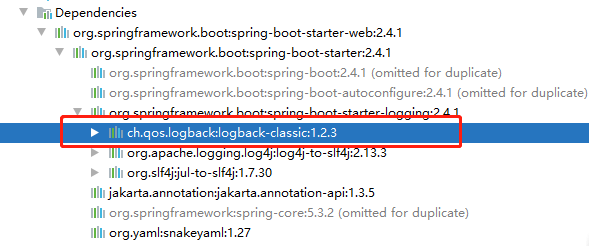](https://img2020.cnblogs.com/blog/1979837/202101/1979837-20210126135934174-1233336979.png)

## 开始配置

在resource下新建log文件夹,并且在其中创建logback.xml

[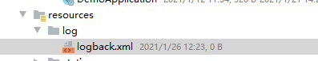](https://img2020.cnblogs.com/blog/1979837/202101/1979837-20210126122352485-285507863.png)

 

###  logback.xml


```xml
<configuration>
    <!--本文主要输出日志为控制台日志，系统日志，sql日志，异常日志-->
    <!-- %m输出的信息,%p日志级别,%t线程名,%d日期,%c类的全名,,,, -->
    <!--控制台-->
    <appender name="console" class="ch.qos.logback.core.ConsoleAppender">
        <encoder>
            <pattern>%d %p (%file:%line\)- %m%n</pattern>
            <charset>UTF-8</charset>
        </encoder>
    </appender>

    <!--系统info级别日志-->
    <!--<File> 日志目录，没有会自动创建-->
    <!--<rollingPolicy>日志策略，每天简历一个日志文件，或者当天日志文件超过64MB时-->
    <!--encoder 日志编码及输出格式-->
    <appender name="fileLog"
              class="ch.qos.logback.core.rolling.RollingFileAppender">
        <File>log/file/fileLog.log</File>
        <rollingPolicy class="ch.qos.logback.core.rolling.TimeBasedRollingPolicy">
            <fileNamePattern>log/file/fileLog.log.%d.%i</fileNamePattern>
            <timeBasedFileNamingAndTriggeringPolicy class="ch.qos.logback.core.rolling.SizeAndTimeBasedFNATP">
                <!-- or whenever the file size reaches 64 MB -->
                <maxFileSize>64 MB</maxFileSize>
            </timeBasedFileNamingAndTriggeringPolicy>
        </rollingPolicy>
        <encoder>
            <pattern>
                %d %p (%file:%line\)- %m%n
            </pattern>
            <charset>UTF-8</charset>
            <!-- 此处设置字符集 -->
        </encoder>
    </appender>

    <!--sql日志-->
    <appender name="sqlFile"
              class="ch.qos.logback.core.rolling.RollingFileAppender">
        <File>log/sql/sqlFile.log</File>
        <rollingPolicy class="ch.qos.logback.core.rolling.TimeBasedRollingPolicy">
            <fileNamePattern>log/sql/sqlFile.log.%d.%i</fileNamePattern>
            <timeBasedFileNamingAndTriggeringPolicy class="ch.qos.logback.core.rolling.SizeAndTimeBasedFNATP">
                <!-- or whenever the file size reaches 64 MB -->
                <maxFileSize>64 MB</maxFileSize>
            </timeBasedFileNamingAndTriggeringPolicy>
        </rollingPolicy>
        <!--对记录事件进行格式化。负责两件事，一是把日志信息转换成字节数组，二是把字节数组写入到输出流。-->
        <encoder>
            <!--用来设置日志的输入格式-->
            <pattern>
                %d %p (%file:%line\)- %m%n
            </pattern>
            <charset>UTF-8</charset>
            <!-- 此处设置字符集 -->
        </encoder>
    </appender>


    <!--异常日志-->
    <appender name="errorFile"
              class="ch.qos.logback.core.rolling.RollingFileAppender">
        <File>log/error/errorFile.log</File>
        <rollingPolicy class="ch.qos.logback.core.rolling.TimeBasedRollingPolicy">
            <fileNamePattern>log/error/errorFile.%d.log.%i</fileNamePattern>
            <timeBasedFileNamingAndTriggeringPolicy class="ch.qos.logback.core.rolling.SizeAndTimeBasedFNATP">
                <!-- or whenever the file size reaches 64 MB -->
                <maxFileSize>64 MB</maxFileSize>
            </timeBasedFileNamingAndTriggeringPolicy>
        </rollingPolicy>
        <!--对记录事件进行格式化。负责两件事，一是把日志信息转换成字节数组，二是把字节数组写入到输出流。-->
        <encoder>
            <!--用来设置日志的输入格式-->
            <pattern>
                %d %p (%file:%line\)- %m%n
            </pattern>
            <charset>UTF-8</charset>
            <!-- 此处设置字符集 -->
        </encoder>
        <!--
            日志都在这里 过滤出 error
            使用 try {}catch (Exception e){} 的话异常无法写入日志，可以在catch里用logger.error()方法手动写入日志
            -->
        <filter class="ch.qos.logback.classic.filter.LevelFilter">
            <level>ERROR</level>
            <onMatch>ACCEPT</onMatch>
            <onMismatch>DENY</onMismatch>
        </filter>
    </appender>
    <!--  日志输出级别 -->
    <!--All\DEBUG\INFO\WARN\ERROR\FATAL\OFF-->
    <!--打印info级别日志，分别在控制台，fileLog，errorFile输出
        异常日志在上面由过滤器过滤出ERROR日志打印
    -->
    <root level="INFO">
        <appender-ref ref="fileLog" />
        <appender-ref ref="console" />
        <appender-ref ref="errorFile" />
    </root>

    <!--打印sql至sqlFile文件日志-->
    <logger name="com.springboot.demo.mapper" level="DEBUG" additivity="false">
        <appender-ref ref="console" />
        <appender-ref ref="sqlFile" />
    </logger>
</configuration>
```

### 添加配置在application.yml


```yaml
logging:
  # 设置logback.xml位置
  config: classpath:log/logback.xml
```

### 编写代码

　　在服务类上添加@Slf4j

[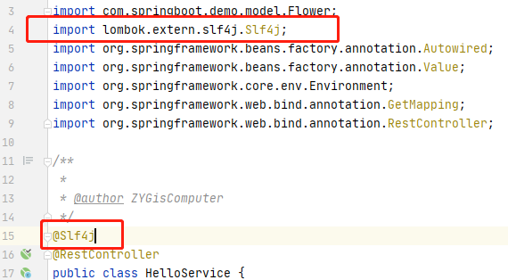](https://img2020.cnblogs.com/blog/1979837/202101/1979837-20210126141004505-1529251245.png)

 

这个注解是lombok的,所以在使用的时候需要先集成lombok,如果不知道如何集成的小伙伴可以看一下我的《[SpringBoot之SpringBoot整合lombok](https://www.cnblogs.com/flower-dance/p/14309580.html)》

在方法中就可以直接使用log日志对象了

[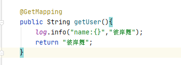](https://img2020.cnblogs.com/blog/1979837/202101/1979837-20210126141235975-1066693980.png)

 

 大括号代表传入参数的意思,log.info方法的第二个参数是不定长参数可以无限传入,但是建议不到太多

## 启动项目测试:

访问成功

[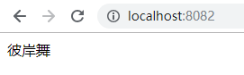](https://img2020.cnblogs.com/blog/1979837/202101/1979837-20210126141437913-1626175037.png)

看一下控制台

[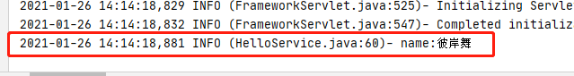](https://img2020.cnblogs.com/blog/1979837/202101/1979837-20210126141505798-1097737419.png)

 

 成功打印

本来我以为是在resource/log下 创建那三个文件夹并存放日志文件呢,找了半天没找到,后来 发现 logback是在项目的根路劲下创建了文件夹和文件,并存入了日志

[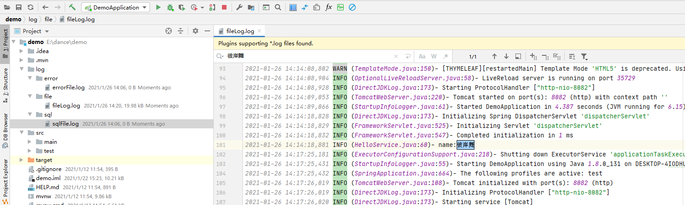](https://img2020.cnblogs.com/blog/1979837/202101/1979837-20210126142211565-1021798429.png)

 

 比如我刚才访问的地址输出的 彼岸舞 也存放到了里面,接下来 我访问一下Mapper中的方法

访问的时候报错了

[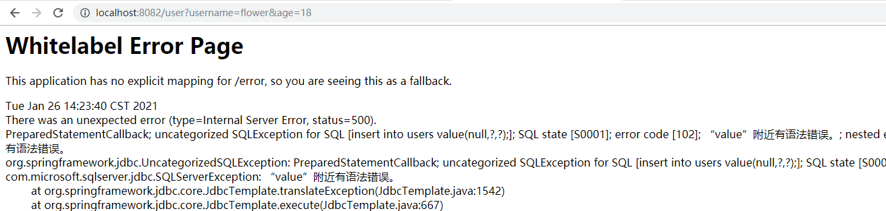](https://img2020.cnblogs.com/blog/1979837/202101/1979837-20210126142459659-807439734.png)

 

那么看一下,有没有记录到error中呢

[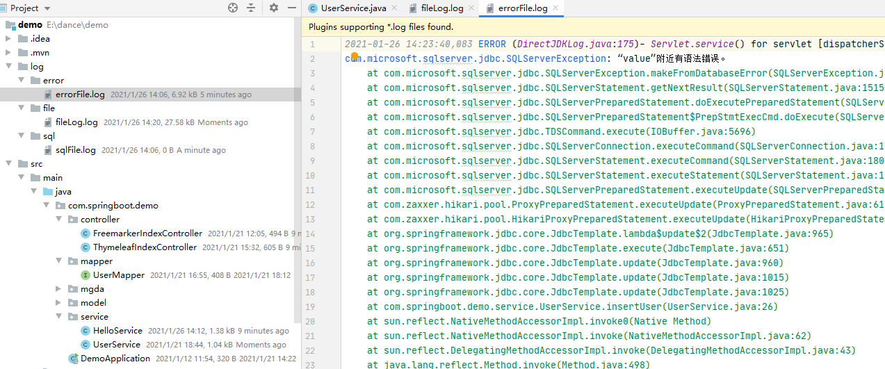](https://img2020.cnblogs.com/blog/1979837/202101/1979837-20210126142540821-1823830626.png)

 

 记录了,其实fileLog.log中也是有记录的,为什么会报错呢,因为之前我把数据库连接改了,导致连接的数据库不对,改回来重新启动测试

[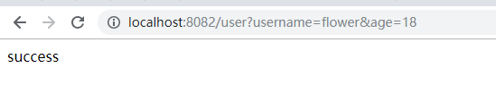](https://img2020.cnblogs.com/blog/1979837/202101/1979837-20210126142834408-1239282762.png)

 

 访问成功,查看一下日志,但是我发现他并没有往日志中记录Sql的日志,为什么呢?我丢...找了半天发现集成的东西太多了,走的是jdbcTemplate的代码,没有走mybatis的所以没有打印

重新访问user2接口

[](https://img2020.cnblogs.com/blog/1979837/202101/1979837-20210126150656724-622209560.png)

 

 查看日志

[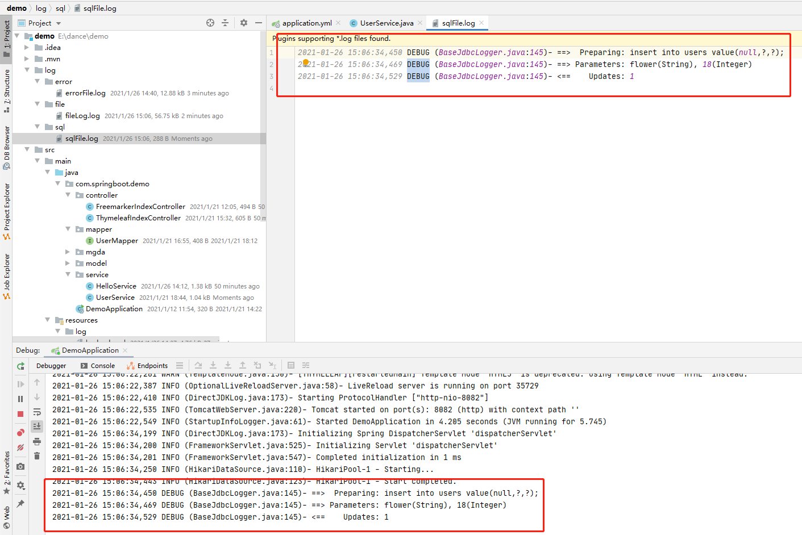](https://img2020.cnblogs.com/blog/1979837/202101/1979837-20210126150723277-1513569145.png)

 

 可以看到日志已经被添加到sqlFile.sql**中**